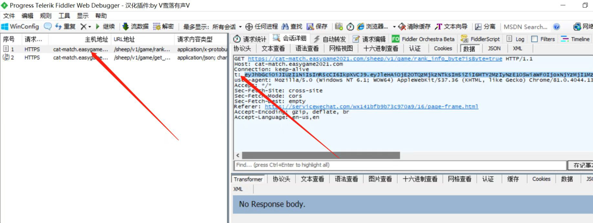
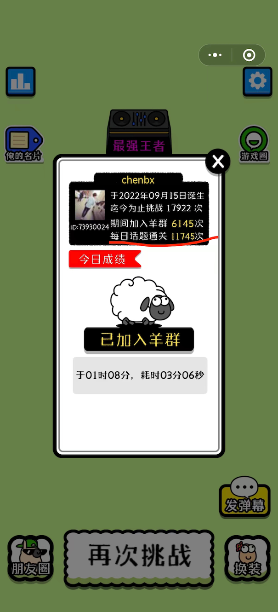

# yang_tools

羊通关脚本，魔法打败魔法

# 说明
## 准备
1.用户获取自己的token.
可以采用charles fodder进行包
（这个方法大家网上搜索一下就知道了。）


这大概就是包的样子了。



获取用户token ：图片中箭头（t：）后面
2.脚本里替换成自己的token就好了

## JiaRu.py
描述：加入羊群脚本
命令
```
python JiaRu.py
```


## TongGuan.py
描述：通关脚本
命令
```
python JiaRu.py
```


# 交流
## 加好友

## 接受投喂

